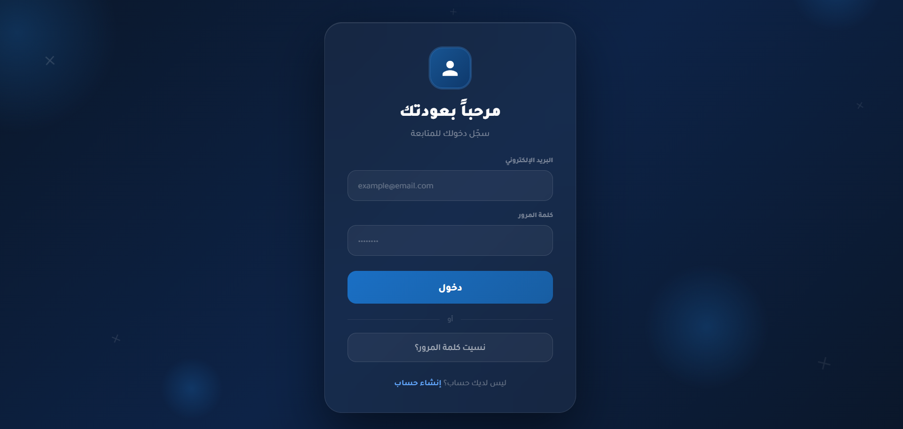
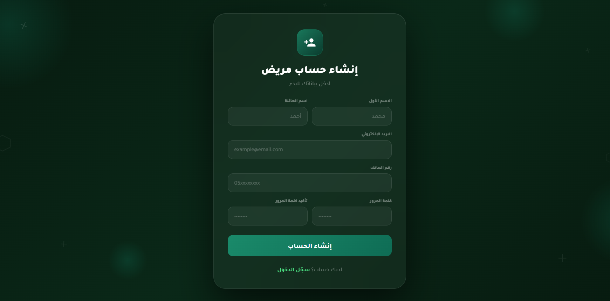
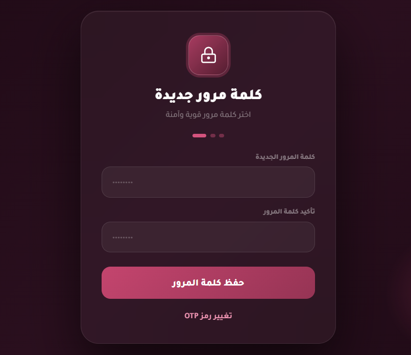
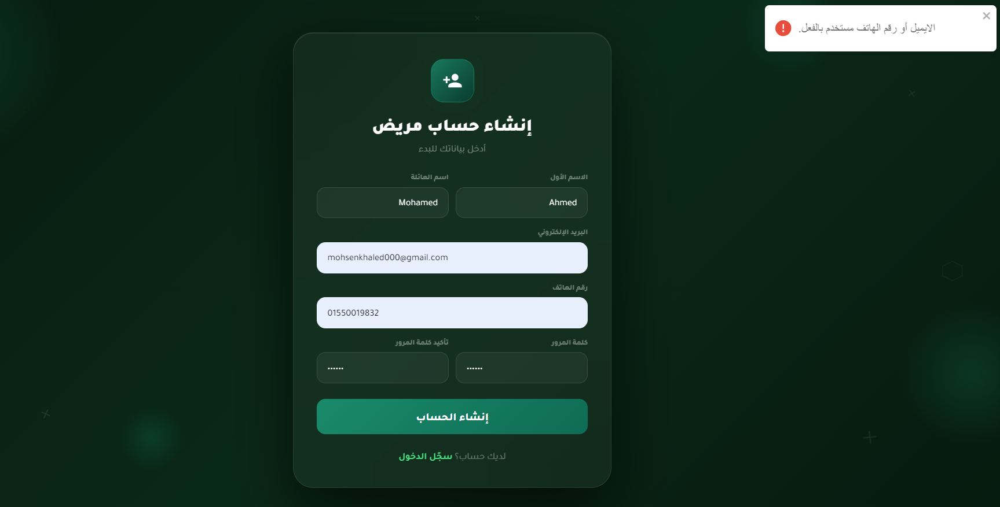
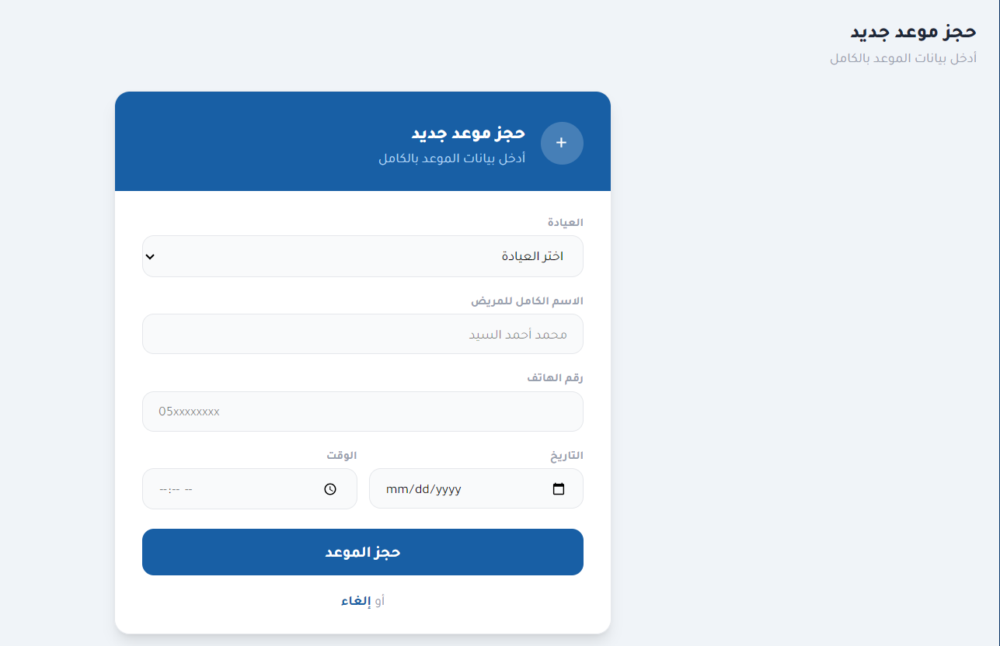
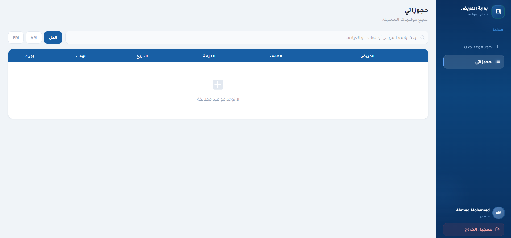
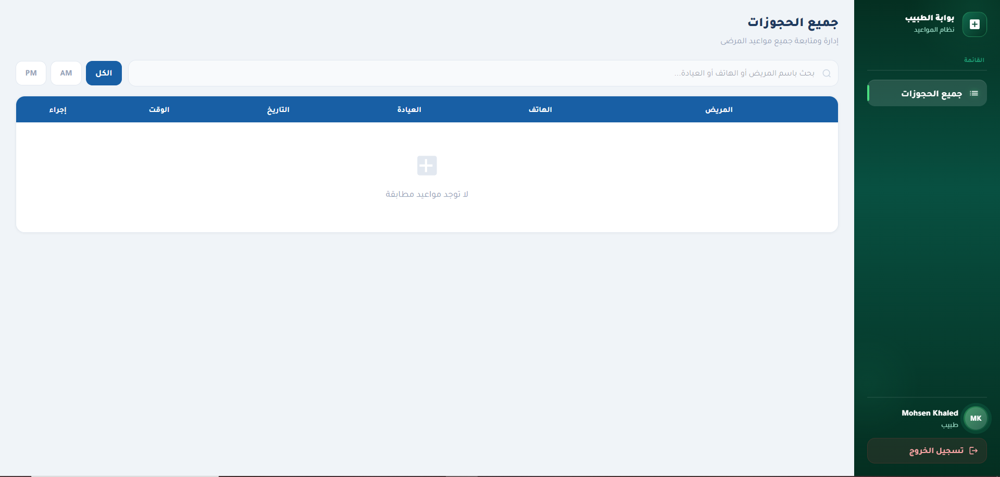

#  Clinic Booking System

A full-stack web application for managing patient appointments and doctor schedules efficiently.

##  Features
- Secure authentication using JWT
- Role-based access (Doctor / Patient)
- Smart appointment scheduling (no conflicts)
- OTP verification system
- Email-based account recovery
- Fully responsive design

##  Tech Stack
- ASP.NET Core Web API
- Entity Framework Core
- SQL Server
- React + Vite
- Tailwind CSS

##  Screenshots

###  Login Page

###  Register Page

###  ResetPassword Page

###  validation Page

###  addOTPNumber Page

###  addappointment Page

###  patientDashboard

###  DoctorDashboard
